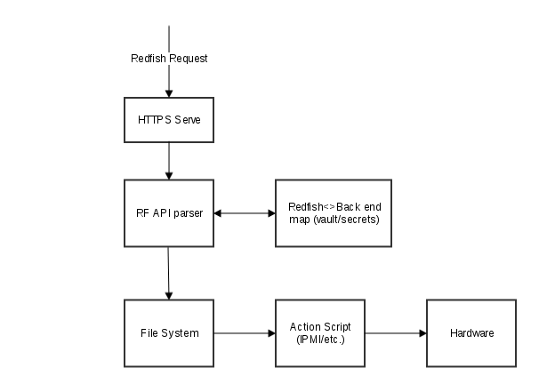
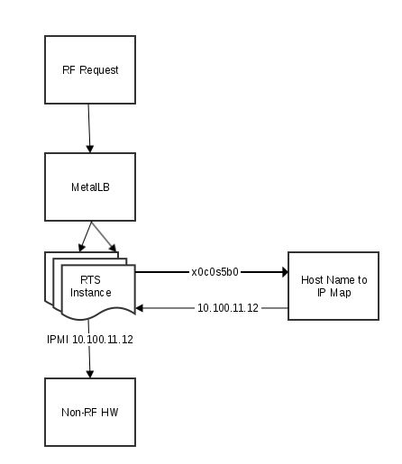
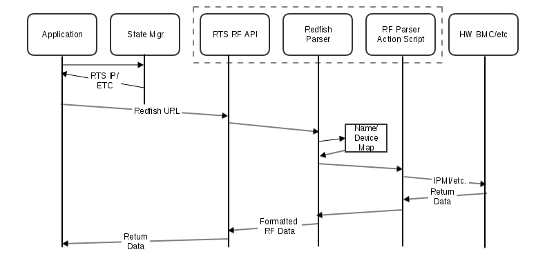

1.  [CASMHMS](index.html)
2.  [CASMHMS Home](CASMHMS-Home_119901124.html)
3.  [Design Documents](Design-Documents_127906417.html)

#  CASMHMS : Redfish Translation Service 

Created by  Rod Frost, last modified by
 Matt Kelly on Apr 19, 2019

-   [Background](#RedfishTranslationService-Background)
-   [RTS Operation](#RedfishTranslationService-RTSOperation)
    -   [Kubernetes, IP Addressing,
        Pods](#RedfishTranslationService-Kubernetes,IPAddressing,Pods)
        -   [Kubernetes Pods](#RedfishTranslationService-KubernetesPods)
        -   [Backing Store](#RedfishTranslationService-BackingStore)
        -   [IP Address
            Handling](#RedfishTranslationService-IPAddressHandling)
        -   [Credential
            Handling](#RedfishTranslationService-CredentialHandling)
    -   [REDS And HW
        Discovery](#RedfishTranslationService-REDSAndHWDiscovery)
-   [RTS Internals](#RedfishTranslationService-RTSInternals)
-   [Authentication](#RedfishTranslationService-Authentication)
    -   [General Authentication Work
        Flow](#RedfishTranslationService-GeneralAuthenticationWorkFlow)
    -   [Credentials For RTS North
        API](#RedfishTranslationService-CredentialsForRTSNorthAPI)
    -   [Authentication Use Cases To
        Consider](#RedfishTranslationService-AuthenticationUseCasesToConsider)
        -   [Powering on/off a small number of nodes, all
            BMCs/controllers use the same
            credentials](#RedfishTranslationService-Poweringon/offasmallnumberofnodes,allBMCs/controllersusethesamecredentials)
        -   [Powering off a very large number of nodes, all at once, all
            target BMCs/controllers use unique
            credentials](#RedfishTranslationService-Poweringoffaverylargenumberofnodes,allatonce,alltargetBMCs/controllersuseuniquecredentials)
        -   [Powering off a very large number of nodes, all at once,
            groups of BMCs/controllers use the same
            credentials](#RedfishTranslationService-Poweringoffaverylargenumberofnodes,allatonce,groupsofBMCs/controllersusethesamecredentials)
-   [Environmental
    Telemetry](#RedfishTranslationService-EnvironmentalTelemetry)
-   [Work Flows](#RedfishTranslationService-WorkFlows)
    -   [Kubernetes And RTS
        Pods](#RedfishTranslationService-KubernetesAndRTSPods)
    -   [REDS](#RedfishTranslationService-REDS)
    -   [RTS](#RedfishTranslationService-RTS)
        -   [/params](#RedfishTranslationService-/params)
        -   [GET
            /redfish/v1/...](#RedfishTranslationService-GET/redfish/v1/...)
        -   [PATCH, PUT
            /redfish/v1/...](#RedfishTranslationService-PATCH,PUT/redfish/v1/...)
        -   [POST /redfish/v1/... (Resource value
            replacement)](#RedfishTranslationService-POST/redfish/v1/...(Resourcevaluereplacement))
        -   [POST /redfish/v1/...
            (Action)](#RedfishTranslationService-POST/redfish/v1/...(Action))

# Background

There has been an ask to be able to support non-redfish devices with all
of the Hardware Management Services, more specifically the ask is that
we are able to power on/off PDU's.  Most if not all PDU's are not
redfish enabled devices and thus would need their own method of
controlling the  power (most likely IPMI).  There are multiple ways to
accomplish this but the most logical and cleanest way would be to make
these PDU's look like a redfish device.   This would allow us to manage
these devices just like all other devices.   There would be no changes
needed to CAPMC, HSM, Telemetry or any other HMS.

To be able to accomplish the proposal we propose we use code already
developed by our intern Ryan S, this code base allows us to talk to
these PDU's through a redfish interface.     This service will be called
RTS (Redfish Translation Service) and will be a container.   Each
non-redfish device (PDU) will be a containerized POD
in the system.    This POD when initialized will read an IP, 
credentials, xname, and MAC address for the PDU from either a config
file or from environment variables.   

On initialization of the POD it will 1st pre-populate a REDIS database
with all of the redfish endpoints (URI) that the PDU will support (this
code is already written - may need some modifications).  Next it will
call a HSM API to register the discovery of this RTS for the PDU into
the HSM.   

To HSM this will look like any other redfish discovered device.   HSM will then walk the
Redfish schema tree  for inventory discovery.   For example HSM
can determine the URI for power by learning this from RTS, through the
redfish inventory mechanism.  For the PDU, for example,  this URI 
/redfish/v1/Chassis/PDU/Actions/Chassis.Reset  would be stored in REDIS
and returned to HSM during inventory discovery.

  

CAPMC would call HSM with the Xname of the PDU to get the redfish
endpoint for power, HSM would give back the IP address of the RTS POD
for that PDU along with the URI for power on.   CAPMC would then call
the URI for power action example
X.X.X.X/redfish/v1/Chassis/PDU/Actions/Chassis.Reset to Power on the
device.     The RTS would then run a script on the SMS that resides in a
file /redfish/v1/Chassis/PDU/Actions/Chassis.Reset/Target.     Thus all
we need to do is add the IPMI commands for powering on the PDU into the
Target file.    This work needs to be done
regardless of the method used to reach the hardware, but in the context
of the Redfish parser it should be minimal.

  

For Telemetry this would work very similar to the River nodes. 
 Telemetry would poll the URI for the items it is interested in.    The
Redfish URI for the target non-Redfish hardware will be used, and thus
it will work the same for both Redfish and non-Redfish capable hardware.

# RTS Operation

The following describes the work flow of the Redfish Translation
Service.  There are several aspects to consider:

-   How the RTS service is deployed in Kubernetes
-   How the RTS service directs actions – Redfish into its northbound
    API, HW-specific protocol (IPMI, etc.) out of its southbound API
-   How the RTS deployment allocates and uses IP addresses for north
    bound Redfish compliant API
-   How the RTS performs HW specific tasks, and how it deals with
    different HW types
-   REDS and HW discovery w/r/t RTS.
-   How RTS deals with telemetry
-   How RTS handles credentials

## Kubernetes, IP Addressing, Pods

RTS will be deployed as a set of Kubernetes pods, implemented as a
stateless horizontally replicated set of instances, which are
load-balanced.  Any given instance can receive a Redfish message on its
north bound API, and direct it to the proper south bound API using the
correct HW action.

### Kubernetes Pods

RTS will be deployed as a typical stateless horizontally replicated set
of instances.  The number of instances will depend on the implementation
of the RTS service; it can either be a small number of instances where
operations are multiplexed, or one instance per non-Redfish hardware
device.  This is an implementation detail that will be dealt with when
the service is developed.

### Backing Store

A backing store will be needed so that all instances of RTS have access
to common information.  An instance of ETCD could be used to store this
information, but the more likely implementation will be Vault or
Kubernetes Secrets, since it will be needed for storage of other
information used by RTS (like authentication details).   A relatively
small amount of info is needed to be stored, and accesses should be
fairly infrequent; thus, it may be possible to share an  instance of
Vault (if that is used) with some other service, such as the Heartbeat
or SCN fanout service.  This is TBD.

### IP Address Handling

All instances will have access to the mapping of IP addresses, and
possibly ports, coming in the north bound API (which is Redfish) to the
south bound API (HW specific IPMI, etc.).  This mapping comes in from
REDS, and is placed
into the backing store, which the RTS pods will then read from to get
the mapping.

The instances are load balanced using MetalLB. There are several ways to
do the IP addressing such that each Redfish URL is unique for each
non-Redfish device:

-   Use a unique IP address per non-Redfish device handled by RTS, and
    use a single port.
-   Use a single IP address for all non-Redfish device handled by RTS,
    and use a different port for each non-Redfish device.
-   Use a single IP address for all non-Redfish device, but have
    hostname aliases which all resolve to this single IP address

The RTS service will receive the Redfish-compliant URL and use the IP
address, port, or hostname, or a combination of these to map to a
specific non-Redfish device.

REDS will determine the
mapping of  RTS IP addresses to actual HW addresses, as well as the HW
interface type (IPMI, SNMP, etc.) (outside the scope of this document). 
This information is placed into the backing store that is accessible to
the RTS pod set.  The HW interface type info is determined via REDS as
well, and likely comes from a config file.

RTS will use this mapping to direct inbound Redfish API calls to the
back-end HW.

### Credential Handling

Redfish operations use credentials.   IPMI and other operations can as
well.   The RTS service will forward any credential transactions to the
target back-end hardware interface using the same paths as other
Redfish&lt;-&gt;non-Redfish operations.  Any credential information to
be stored will be stored in the REDIS database of the RTS service.

## REDS And HW Discovery

REDS is used to discover MAC addresses
of BMCs, River nodes, and will soon handle non-Redfish devices like
iPDUs in River cabinets.  REDS uses a combination of discovery images
which are PXE booted on compute nodes and also config files to fill in
the blanks where things can't be automatically discovered (such as geo
location info, and Redfish vs. non-Redfish BMCs).  

Once all information is discovered, the XNames, IP addresses, and
credentials of the discovered BMCs are sent to the Hardware State
Manager.  **NOTE: this process will need to be extended.  See  below.**

When directed by an
administrator, the Hardware State Manager performs a Hardware
Discovery operation, where it uses the BMCs XName/IP addr to execute
Redfish calls to get inventory/FRU information about the nodes/devices
in the system.

In order for HSM to use the RTS service and treat all HW as Redfish
endpoints, a mapping must be set up between the discovered BMC IP
addresses and the current pool of RTS service IP addresses.  HSM can't
use the actual BMC IP addresses; it must use the RTS service IP
addresses if Redfish calls are to be made.

Therefore REDS will need to contact MetalLB, via a REST call, to get the
IP address range of the RTS pods, create the mapping, and do a REST call
to the RTS service to tell it to set up and store the mapping for its
internal use.  REDS will use the RTS IP address mapped to the specific
device in its information it gives to HSM.

For credentials, the non-Redfish BMC credentials will be stored as
always.  The RTS service will just pass them through to the IPMI/etc.
BMC.

When Discovery is to be done, HSM will do what it normally does, do
Redfish calls to all endpoiints.  RTS will then handle the translations.

# RTS Internals

RTS will be based on the Redfish
Parser
(<https://stash.us.cray.com/projects/HMS/repos/hms-go-redfish-parser/browse>)
and the Redfish Dispatcher
(<https://stash.us.cray.com/projects/HMS/repos/hms-redfish-dispatcher/browse>). 
This sets up a system where a Redfish schema file is read in along with
a mapping file, and a schema tree is generated at service startup time. 
 This will be hooked up so as to present it's Redfish Compliant
northbound API.

The Redfish Parser will create a file system within its pod which
matches the URLs of the Redfish API.   For example:

<https://10.1.2.3/redfish/v1/Chassis/PDU/Actions/Chassis.Reset>

would correspond to a file:

&lt;some\_root&gt;/v1/Chassis/PDU/Actions/Chassis.Reset

in which a script would live which performs the action.

REDIS sits between the parser and the dispatcher.  Keys are stored in
REDIS by an init script that is run when RTS starts up.  The values in
the keys are modified when a Redfish REST call comes in the north API.  

The back end responds to key value changes, and the value of the key is
passed to the action script.

When a REST call is done to RTS, the
GO code in the RF parser and dispatcher will look for and call the
appropriate executable script in the generated file system.

Thus, for IPMI devices, the script in question will perform IPMI
commands, and return the data back up to the Redfish Parser/Dispatcher,
and the data will be returned to the caller.

The development work involved in using the Redfish Parser/Dispatcher
will be to generate the file system, the action script, and writing the
REDIS initializer, and adding in any code that uses the hostname/IP:port
to map the the back end HW.

<table class="gliffy-macro-table" width="100%">
<colgroup>
<col style="width: 100%" />
</colgroup>
<tbody>
<tr class="odd">
<td><table class="gliffy-macro-inner-table">
<tbody>
<tr class="odd">
<td></td>
</tr>
</tbody>
</table></td>
</tr>
</tbody>
</table>

# Authentication

Non-Redfish capable devices will have their own authentication schemes;
some may have none, some may use username/password either in clear text
(hopefully not!) or using something similar to Redfish Basic
Authentication.

In any case, credentials will have to be used.   Thus, there needs to be
a secure way to store these credentials in a way that is secure.  

For the short term, HashiCorp's VAULT will be used.  It has a simple
interface and is very secure.   The down side to using VAULT is that it
is more difficult to use system-wide.  Thus, in the future there will be
a more universal mechanism that can be used by all services for storing
and retrieving credentials.

## General Authentication Work Flow

1.  RTS receives a REST request to perform some action on a non-redfish
    device.
2.  RTS looks up the mapping of the XName in the request to the target
    device and determines the correct script/app to call to interact
    with it.
3.  RTS looks up the access credentials for this device from VAULT (or,
    in the future, using the common secure credential store).
4.  RTS places credentials into REDIS.
5.  Back-end script/app gets credentials and performs the operation.

## Credentials For RTS North API

Note that in addition to the credentials needed for interaction with the
target non-Redfish devices, credentials are also needed for contacting
the RTS north API itself.  These currently reside in the Hardware State
Manager, as are all other Redfish authentication credentials.   This
will be changed, and these credentials will also be stored in the secure
credential store future implementation.

## Authentication Use Cases To Consider

There are use cases which should be considered in light of system
scaling.   For example, a 50k node system can require lots of power
operations to be done in a short time, which can stress the system.

### Powering on/off a small number of nodes, all BMCs/controllers use the same credentials

In this use case, RTS will make a very small number of calls to the
credential store, possibly only one call.   This is the simplest, best
case scenario.

### Powering off a very large number of nodes, all at once, all target BMCs/controllers use unique credentials

In this use case, CAPMC and RTS will receive requests to perform a large
number of power-off operations, both to Redfish-compliant and
non-Redfish-compliant hardware respectively.  This can happen when
rebooting/re-initializing a large system, or if a system is completely
wedged and needs to be nuked.    Some notes to consider:

-   This is unlikely to happen often.
-   Most likely the vast majority of the HW to be targeted will be
    Redfish compliant.
-   Eventually, a common credential store will contain credentials for
    Redfish and non-Redfish hardware
-   Due to power ramp-rate limiting, large numbers of power-offs (or
    power-ons) are likely to be staggered to play nicely with the power
    grid, reducing the immediate load.  This can be over-ridden in
    emergencies however.
-   If this is an emergency or wedge-up condition, the management plane
    is likely to be very busy with syslog floods and possibly other
    telemetry over and above what is normal.

Worst case, a large number of nodes, say 50k, are powered off at once. 
Due to customer security policies in this hypothetical case, each
BMC/controller has different access credentials.   This means that CAPMC
(Redfish) and RTS (non-Redfish) will pound the credential store very
hard for a short burst.

This case highlights the importance of implementing a secure
credential/secrets store in such a way that stressing it does not affect
the management system, nor is a stressed management system to affect the
performance of the credential store.

### Powering off a very large number of nodes, all at once, groups of BMCs/controllers use the same credentials

Same scenario as above, but this case imparts a lighter load on the
credential store, since groups of BMCs/controllers share credentials,
resulting on a small number of requests.  For example, all River BMCs
and Mountain node controllers use one common set of credentials, and all
iPDUs use one different set of credentials.  This is two accesses,
ideally.

# Environmental Telemetry

On Redfish-capable devices, it is generally (but not always) possible to
set up the Redfish Event system so that the device will send periodic
telemetry data to a specified URL.

For non-Redfish devices, which are interacted with via RTS, there are
two choices:

-   Set up RTS so that it has an event system of sorts.  The
    registration takes place in RTS, and it performs polling to the
    actual HW device on the back end, sending the data back out the
    front end as specified.
-   Do polling-style telemetry in a telemetry collector.

If we do the latter, there is nothing special for RTS to do to make
telemetry work.

If we do the former, then the RTS service has to have a way to track
subscribers and the telemetry parameters for each subscriber and
endpoint, and then perform the data polling when needed, and send the
data on to the subscriber.   This code would likely be somewhat like
what the SCN fanout service does.

**At this point in time, it appears that polling-style telemetry is
allowed for non-Redfish devices; thus, no event service type mechanism
will be implemented in RTS.**

# Work Flows

## Kubernetes And RTS Pods

The RTS pods will be set up to be run in Kubernetes just like any other
HMS services.  There will be some replication factor to help with
scaling and redundancy.

RTS pods will have access to a map between the Redfish URLs and the
target non-Redfish hardware IP address.   When a Redfish request is made
to the RTS service, the HTTP header will be inspected and the hostname
or IP address, and possibly the port number, will be used when mapping
to the back-end target hardware.

MetalLB will be used to assign and load balance the IP address(es) used
for RTS.   One instance of MetalLB is needed per RTS IP address used.

To make each non-Redfish component's API unique, the aforementioned
mapping will need to rely on one of the following:

-   The IP address of the Redfish request URL (found in the HTTP header)
-   The hostname of the Redfish request URL (found in the HTTP header;
    IP address or hostname are present, not both)
-   The TCP/IP port number used in the Redfish request URL.

It is possible to deploy RTS so that there is a single IP address and
multiple ports.   This requires only one instance of MetalLB for RTS. 
In this case the URL to target HW mapping is based solely on the port
number in the request.

Another option is to have a pool of IP addresses, one per non-Redfish
device.  This requires an instance of MetalLB per IP address.  In this
case the IP address in the URL is used to map to the target HW.

A third option is to use a single IP address and either DNS or an
/etc/hosts file on the SMS cluster to assign  unique names for each
target HW device, all mapped to the same single RTS IP address.  Then
RTS would use this hostname to map to the target HW.

There are pros and cons to each approach.  These decisions will need to
be made at RTS implementation time.

  

<table class="gliffy-macro-table" width="100%">
<colgroup>
<col style="width: 100%" />
</colgroup>
<tbody>
<tr class="odd">
<td><table class="gliffy-macro-inner-table">
<tbody>
<tr class="odd">
<td></td>
</tr>
</tbody>
</table></td>
</tr>
</tbody>
</table>

## REDS

The current REDS work flow can be seen here:  [River Endpoint Discover
Service
(HMS)\#Discoveringanode(newtosystem)](110180596.html#RiverEndpointDiscoverService(HMS)-Discoveringanode(newtosystem)). 
The change needed to this sequence is right before step 11(c), which
states:  "It then sends the x-name and SLAAC-derived IPv6 address to HMS
to register the new endpoint".  At this point REDS knows the
non-Redfish's IP address, interface type, and credentials.   The REDS
sequence (as lifted from the REDS document) will change starting right
after step 11(b) (highlighted in green):

  

1.  The compute node is powered on.  For a brand new node, this will
    likely be via the power button.
2.  The compute node PXEboots.
3.  Because the node is unknown, the HMS-configured DHCP and TFTP
    servers give it the special initialization ramdisk (which is
    configured as the default response for unknown nodes)
4.  The compute node performs local configuration.
5.  The compute node requests per-node BMC credentials from the
    initialization and geolocation daemon.  This message must include
    the MAC address of the BMC.  For security reasons:
    1.  this request must be encrypted (ie: use TLS)
    2.  a new set of credentials is generated and sent each time this
        endpoint is called for a particular MAC address.  This ensures
        that once the credentials are set, there is no way for a node on
        the untrusted management network to retrieve them.
6.  The compute node configures it's BMC to do at least the following:
    1.  Use the credentials from step 5
    2.  enable IPv6 with SLAAC IP address configuration
    3.  enable "Gratuitous ARP"
7.  The compute node resets the BMC ("impitool mc reset cold")
8.  The node signals completion of initialization to the daemon.  This
    message must include the MAC address(es) of the BMC.
9.  When the BMC comes back from the reset, it will send an ARP
    message.  This ARP is received by the switch, which adds it to its
    MAC address tables.
10. Upon modification of the ARP tables, the switch sends an SNMP INFORM
    message to the discovery daemon, notifying it of the newly
    discovered MAC address.
11. Once the discovery daemon has both the SNMP INFORM and the signaled
    completion from the node, it:
    1.  uses the switch ID and mac address to determine the x-name that
        should be associated with the compute node
    2.  verifies that the credentials assigned to the BMC work
    3.  Make a REST call to the
        MetalLB or Kubernetes  service to get the IP address(es) (and
        ports if available) allocated to the RTS service.
    4.  Create a mapping of RTS IP
        addresses and/or possibly ports to HW BMC addresses.
    5.  Make a REST call to the
        RTS service to POST this map.
    6.  Send the x-name and
        SLAAC-derived IPv6  address (Redfish-native devices) or RTS IP
        address (non-Redfish devices) to HMS to register the new
        endpoint
12. HMS or the discovery daemon then uses the BMC credentials to power
    cycle the compute node and have to boot the correct image.

## RTS

The RTS service will have multiple work flows:

-   The /params API, which allows the getting/setting of RTS operational
    parameters
-   The /redfish/v1 API which performs the main purpose of RTS.  Of
    these, there are multiple work flows:
    -   GET operations which fetch information from a resource
    -   PATCH/PUT operations which update/replace information on a
        resource
    -   POST to create a new resource (probably not supported in RTS), 
    -   POST to perform an action (such as RESET)

The following flow diagram shows the sequence for interacting with
non-Redfish-enabled hardware by applications using the RTS-supplied
Redfish API:

  

<table class="gliffy-macro-table" width="100%">
<colgroup>
<col style="width: 100%" />
</colgroup>
<tbody>
<tr class="odd">
<td><table class="gliffy-macro-inner-table">
<tbody>
<tr class="odd">
<td></td>
</tr>
</tbody>
</table></td>
</tr>
</tbody>
</table>

### /params

  

This API is very simple, and only supports the following:

-   GET, which returns the set of current parameters and values.
-   PATCH, which allows the sender to modify one or more parameter
    values.

### GET /redfish/v1/...

GET operations take a Redfish URL in from the northbound API, calls the
action script in the Redfish-parser-created file system, formats the
result to be a proper Redfish response, and return the data out the
northbound API to the caller.

  

**FLOW:**

1.  Caller contacts HSM to get the RTS IP address of the target
    non-Redfish HW device.
2.  Caller (CURL, application, service, etc.) makes a REST GET call to
    the RTS IP address(and possibly port) associated with the target HW
    device.
3.  The RTS service gets the IP address and port used to contact it from
    the HTTP header.
4.  RTS consults a map of RTS IP/port to target HW from the backing
    store to determine which IP address and action script to use for the
    target HW.
5.  RTS calls the action script associated with the URL (e.g.
    &lt;root&gt;/v1/Chassis/PDU/Power) with appropriate data as cmdline
    args, ENV vars, etc.
6.  Action script contacts HW and performs the operation to fetch the
    desired data
7.  RTS translates the returned data into a correct JSON-formatted RF
    compliant response.
8.  RTS returns the data to the caller.

### PATCH, PUT /redfish/v1/...

PATCH operations update some portion of a resource.  Typically this is
some writeable value in the resource.  For example there may be some
sort of environmental limit which is settable in a resource.  A PATCH
operation allows the changing of that setting.

1.  Caller contacts HSM to get the RTS IP address of the target
    non-Redfish HW device.
2.  Caller (CURL, application, service, etc.) makes a REST GET call to
    the RTS IP (and possibly port) address associated with the target HW
    device.
3.  The RTS service gets the IP address used to contact it from the HTTP
    header.
4.  RTS consults a map of RTS IP/port to target HW from the backing
    store to determine which IP address and action script to use for the
    target HW.
5.  RTS calls the action script associated with the URL (e.g.
    &lt;root&gt;/v1/Chassis/PDU/Power) with appropriate data as cmdline
    args, ENV vars, etc.
6.  Action script contacts HW and performs the operation to replace the
    desired data
7.  RTS translates the response data into a correct JSON-formatted RF
    compliant response.
8.  RTS returns the data to the caller.

### POST /redfish/v1/... (Resource value replacement)

POST operations can be used for total replacement of a resource.   One
example would be setting login and password information in a resource
that only contains this info and nothing else (username/password).

1.  Caller contacts HSM to get the RTS IP address of the target
    non-Redfish HW device.
2.  Caller (CURL, application, service, etc.) makes a REST GET call to
    the RTS IP (and possibly port) address associated with the target HW
    device.
3.  The RTS service gets the IP address used to contact it from the HTTP
    header.
4.  RTS consults a map of RTS IP/port to target HW from the backing
    store to determine which IP address and action script to use for the
    target HW.
5.  RTS calls the action script associated with the URL (e.g.
    &lt;root&gt;/v1/Chassis/PDU/Power) with appropriate data as cmdline
    args, ENV vars, etc.
6.  Action script contacts HW and performs the operation to completely
    replace the resource data
7.  RTS translates the response data into a correct JSON-formatted RF
    compliant response.
8.  RTS returns the data to the caller.

  

### POST /redfish/v1/... (Action)

POST operations can also be used to perform actions.  For example,
turning a node on is a POST operation.

  

1.  Caller contacts HSM to get the RTS IP address of the target
    non-Redfish HW device.
2.  Caller (CURL, application, service, etc.) makes a REST GET call to
    the RTS IP address (and possibly port) associated with the target HW
    device.
3.  The RTS service gets the IP address used to contact it from the HTTP
    header.
4.  RTS consults a map of RTS IP/port to target HW from the backing
    store to determine which IP address and action script to use for the
    target HW.
5.  RTS calls the action script associated with the URL (e.g.
    &lt;root&gt;/v1/Chassis/PDU/Power) with appropriate data as cmdline
    args, ENV vars, etc.
6.  Action script contacts HW and performs the operation using the
    correct interface (IPMI, etc.)
7.  RTS translates the response data into a correct JSON-formatted RF
    compliant response.
8.  RTS returns the data to the caller.

  

  

  

## Attachments:

 [CARP
Diagram.png](attachments/127921766/127921767.png) (image/png)  
 [CARP
Diagram](attachments/127921766/127921768) (application/gliffy+json)  

[RF\_GET](attachments/127921766/131799279) (application/gliffy+json)  

[RF\_GET.png](attachments/127921766/131799280.png) (image/png)  

[RF\_GET](attachments/127921766/131799283) (application/gliffy+json)  

[RF\_GET.png](attachments/127921766/131799284.png) (image/png)  

[RF\_GET](attachments/127921766/131799290) (application/gliffy+json)  

[RF\_GET.png](attachments/127921766/131799291.png) (image/png)  

[RF\_GET](attachments/127921766/131799347) (application/gliffy+json)  

[RF\_GET.png](attachments/127921766/131799348.png) (image/png)  

[RF\_POST\_PATCH](attachments/127921766/131799296)
(application/gliffy+json)  

[RF\_POST\_PATCH.png](attachments/127921766/131799297.png) (image/png)  

[RF\_POST\_PATCH](attachments/127921766/131799355)
(application/gliffy+json)  

[RF\_POST\_PATCH.png](attachments/127921766/131799356.png) (image/png)  

[RF\_POST\_Action](attachments/127921766/131799299)
(application/gliffy+json)  

[RF\_POST\_Action.png](attachments/127921766/131799300.png)
(image/png)  

[RF\_GET](attachments/127921766/131799349) (application/gliffy+json)  

[RF\_GET.png](attachments/127921766/131799350.png) (image/png)  

[RF\_GET](attachments/127921766/131799361) (application/gliffy+json)  

[RF\_GET.png](attachments/127921766/131799362.png) (image/png)  

[RF\_POST\_PATCH](attachments/127921766/131799294)
(application/gliffy+json)  

[RF\_POST\_PATCH.png](attachments/127921766/131799295.png) (image/png)  

[RF\_GET](attachments/127921766/131801866) (application/gliffy+json)  

[RF\_GET.png](attachments/127921766/131801867.png) (image/png)  

[LB\_IP\_Addrs](attachments/127921766/131799788)
(application/gliffy+json)  

[LB\_IP\_Addrs.png](attachments/127921766/131799789.png) (image/png)  

[LB\_IPAddr](attachments/127921766/131799792)
(application/gliffy+json)  

[LB\_IPAddr.png](attachments/127921766/131799793.png) (image/png)  

[RF\_GET](attachments/127921766/131801882) (application/gliffy+json)  

[RF\_GET.png](attachments/127921766/131801883.png) (image/png)  

[RF\_GET](attachments/127921766/131801885) (application/gliffy+json)  

[RF\_GET.png](attachments/127921766/131801886.png) (image/png)  

[RF\_GET](attachments/127921766/131802112) (application/gliffy+json)  

[RF\_GET.png](attachments/127921766/131802113.png) (image/png)  

[RTS\_Block\_Diagram](attachments/127921766/136350995)
(application/gliffy+json)  

[RTS\_Block\_Diagram.png](attachments/127921766/136350996.png)
(image/png)  

[RTS\_Internals](attachments/127921766/136351005)
(application/gliffy+json)  

[RTS\_Internals.png](attachments/127921766/136351006.png) (image/png)  

[RF\_GET](attachments/127921766/136351010) (application/gliffy+json)  

[RF\_GET.png](attachments/127921766/136351011.png) (image/png)  

[RTS\_Block\_Diagram](attachments/127921766/136350997)
(application/gliffy+json)  

[RTS\_Block\_Diagram.png](attachments/127921766/136350998.png)
(image/png)  

[RTS\_Block\_Diagram](attachments/127921766/131802061)
(application/gliffy+json)  

[RTS\_Block\_Diagram.png](attachments/127921766/131802062.png)
(image/png)  

[RTS\_Internals](attachments/127921766/131802106)
(application/gliffy+json)  

[RTS\_Internals.png](attachments/127921766/131802107.png) (image/png)  

[RF\_GET](attachments/127921766/131799277) (application/gliffy+json)  

[RF\_GET.png](attachments/127921766/131799278.png) (image/png)  

## Comments:

<table data-border="0" width="100%">
<colgroup>
<col style="width: 100%" />
</colgroup>
<tbody>
<tr class="odd">
<td>

yes this should be for any device that isn't redfish.

 

And agree this is outside the scope but we do have to find a way to discover these non-redfish devices and get them loaded into HSM otherwise the other services will be unable to manage these devices.

 Posted by rfrost at Mar 12, 2019 08:01

</td>
</tr>
<tr class="even">
<td style="border-top: 1px dashed #666666">

Add sequence diagram of how all information is passed from HSM to the POD (things like IP address of the actual device, credentials)

May need API's to update the mapping information inside of HSM (things like IP Address etc).

 

 Posted by rfrost at Mar 12, 2019 13:46

</td>
</tr>
<tr class="odd">
<td style="border-top: 1px dashed #666666">

How much data are you putting into Redis? I was curious why using that rather than just re-using etcd for storing the endpoint information since you are already using etcd for something else. I assume the endpoint data is easily rediscoverable so it doesn’t need to be persisted?

 

I don’t know enough about how we’re running redis to make a recommendation but is the data in there secure enough to safely store creds? I assume that managing this data with k8s secrets would be unwieldy.

 Posted by mfischer at Apr 11, 2019 15:15

</td>
</tr>
<tr class="even">
<td style="border-top: 1px dashed #666666">

The reason for REDIS is because this code was designed for dual purpose (L1 &amp; L2)

1) For L1 To replace the AMI code running on the controller REDIS is required there

2) For L2 we are using REDIS as an intermediate caching layer.

The information stored in REDIS is not persistent and is mainly used for storage of redfish URI's.

ETCD is no longer needed documented to be updated above.   We will be using Vault to store creds and other pertinent information.

 Posted by rfrost at Apr 17, 2019 10:33

</td>
</tr>
</tbody>
</table>

Document generated by Confluence on Jan 14, 2022 07:17

[Atlassian](http://www.atlassian.com/)
